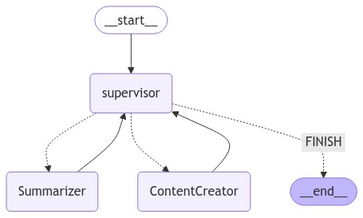

<!-- PROJECT LOGO -->
<br />
<div align="center">
  <a href="https://github.com/MinLee0210/doco.git">
    
  </a>

<h3 align="center">DoCo-Document Compressor</h3>

  <p align="center">
    The project aims to develop an AI platform for extracting weighted features from documents by summarizing and gathering strong relational words.
    <br/>
  </p>
</div>

<!-- TABLE OF CONTENTS -->
<details>
  <summary>📃 Table of Contents</summary>
  <ol>
    <li>
      <a href="#about-the-project">About The Project</a>
    </li>
    <li>
      <a href="#features">Features</a>
    </li>
    <li>
      <a href="#workflow">Wokflow</a>
    </li>
    <li>
      <a href="#getting-started">Getting Started</a>
      <ul>
        <li><a href="#directory-structures">Directory Structures</a></li>
        <li><a href="#prerequisites">Prerequisites</a></li>
      </ul>
    </li>
    <li><a href="#roadmap">Roadmap</a></li>
    <li><a href="#contact">Contact</a></li>
  </ol>
</details>

<div id='about-the-project'><h2>👀 About the project </h2></div>

`doco` utilizes an advanced system using Large Language Models (LLMs) to automatically summarize various types of documents, including reports, news articles, and meeting transcripts. This project aims to help professionals quickly access key insights, trends, and significant events from extensive textual data, facilitating informed decision-making and improving efficiency across different fields.

<div id=features><h2>✨ Features</h2></div>

+ **Context-Aware Summarization**: Capture and highlight relevant information.
+ **Content Creator**: Based on a given document, after summarizing, `doco` create a blog, or conduct a research.

<div id=''><h2>📊 Workflow</h2></div>



<div id='getting-started'><h2>😚 Getting started </h2></div>
<div id='directory-structures'><h3>📁 Directory Structures<h3></div>

```
  | controller    # pipelines of promised tasks are defined here
  | doco          # define core functions
  | test          # place test cases
  .gitignore
  app.py
  TODO            # record what have been done and will be done
  requirements.txt
  README.md
```

<div id='installation'> <h3>🤓 Installation</h3></div>

1. Cloning the project
```
  git clone https://github.com/MinLe0210/Doco
  cd Doco
  pip install -r requirements.txt
```
2. Run streamlit app
```
  streamlit run app.py # to run the app
```

<div id='roadmap'><h2>🎯 Roadmap</h2></div>

<h3>⏳ On development</h3>

We apologize for any inconvenience caused as our project undergoes essential updates. During this period, you may experience disruptions or limited access to our services. We appreciate your patience and understanding as we work to enhance our system. Thank you for your continued support.

- [x] Automated Summarization and Extraction: Automatically summarize documents and extract important features.

- [ ] Sophisticated Sentiment Analysis: Analyze documents to accurately gauge sentiment.

- [ ] Real-Time Question Answering: Implement Retrieval-Augmented Generation (RAG) for real-time question-answering tasks.


<div id='contact'><h2>📨 Contact me</h2></div>
Don't hesitate to contact me via: 

+ Gmail: minh.leduc.0210@gmail.com

+ Linkedin: https://www.linkedin.com/in/minh-le-duc-a62863172/

+ Github: https://github.com/MinLee0210/DoCo.git
