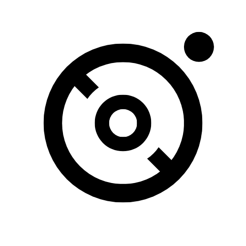
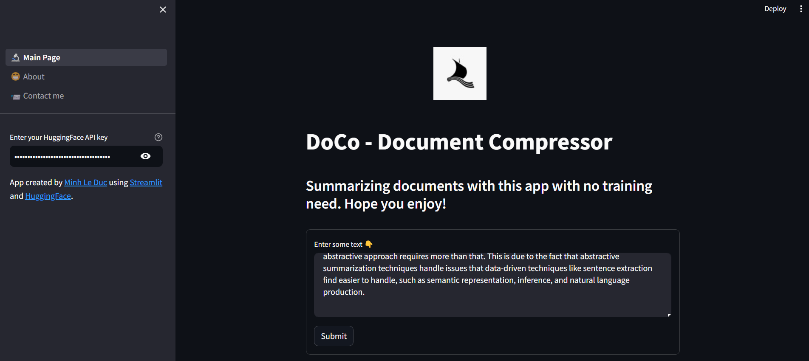
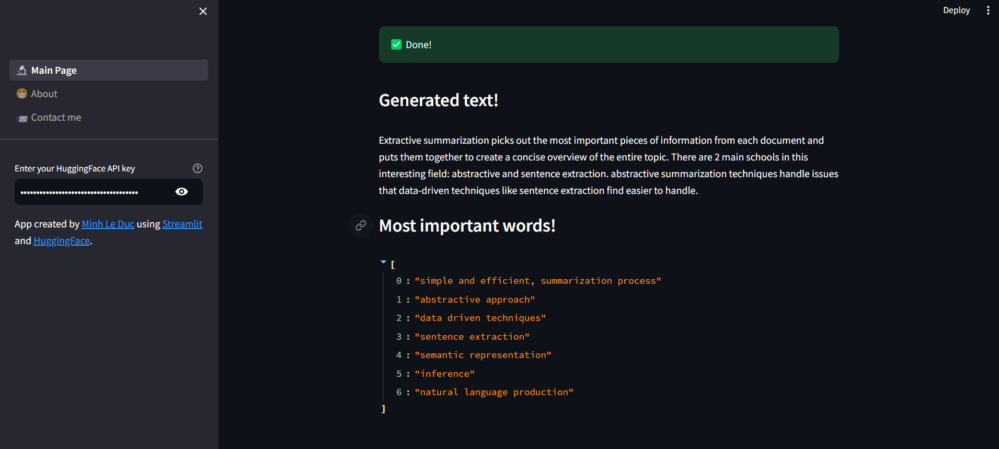

<!-- PROJECT LOGO -->
<br />
<div align="center">
  <a href="https://github.com/MinLee0210/DoCo.git">
    
  </a>

<h3 align="center">DoCo-Document Compressor</h3>

  <p align="center">
    The project aims to develop an AI platform for extracting weighted features from documents by summarizing and gathering strong relational words.
    <br/>
  </p>
</div>

<!-- TABLE OF CONTENTS -->
<details>
  <summary>📃 Table of Contents</summary>
  <ol>
    <li>
      <a href="#about-the-project">About The Project</a>
    </li>
    <li>
      <a href="#getting-started">Getting Started</a>
      <ul>
        <li><a href="#directory-structures">Directory Structures</a></li>
        <li><a href="#prerequisites">Prerequisites</a></li>
      </ul>
    </li>
    <li><a href="#roadmap">Roadmap</a></li>
    <li><a href="#gallery">Gallery</a></li>
    <li><a href="#contact">Contact</a></li>
    <li><a href="#acknowledgements">Acknowledgments</a></li>
  </ol>
</details>

<div id='about-the-project'><h2>👀 About the project </h2></div>
The project aims to build an AI platform for extracting most weighted features in a documents. To achieve the goal, summarizing and gather strong relation words within a document are focused. The project will experience 2 settings: 

1. Using AI summarizer as a blackbox. In detail, we will use LLM models and design a prompt to pursue the task. 
2. Using existing researches as use-cases for developments.

<div id=''><h2>CURRENT STATUS</h2></div>
<h1>ON DEVELOPMENT</h1>
We are changing our system into llama environment.


<div id='getting-started'><h2>😚 Getting started </h2></div>
<div id='directory-structures'><h3>📁 Directory Structures<h3></div>

```
  | controller    # where we write functions and prompts
    | apiv1       => Use HuggingFace's API Inference.
    | apiv2       => Use LangChain along with HuggingFacePipeline to summarize the task. 
  | models        # models, if it is neccessary to be downloaded, it would be stored here. 
  | notebooks     # we store demonstrations, explanations, documents, Jupyter notebooks, ...
  | static        # where we store images: logo, results, ...
  | views         # for UI
  .gitignore
  app.py
  CHANGELOG.MD
  TODO
  config.py
  README.md
```

<div id='installation'> <h3>🤓 Installation</h3></div>

```
  git clone https://github.com/MinLe0210/Doco
  cd Doco
  streamlit run app.py # to run the app
```

<div id='roadmap'><h2>🎯 Roadmap</h2></div>

👉 Using API-Inference. 

👉 Conducting with LLM-Framework. 

👉 Building a web application. 

<div id='gallery'><h2>Gallery</h2></div>

An example of how the agent works
<p align="center">
  
  &nbsp; &nbsp; &nbsp; &nbsp;
   
</p>

<div id='contact'><h2>📨 Contact me</h2></div>
Don't hesitate to contact me via: 

+ Gmail: minh.leduc.0210@gmail.com

+ Linkedin: https://www.linkedin.com/in/minh-le-duc-a62863172/

+ Github: https://github.com/MinLee0210/DoCo.git

<div id='acknowledgements'><h2>💚 Acknowledgements</h2></div>
